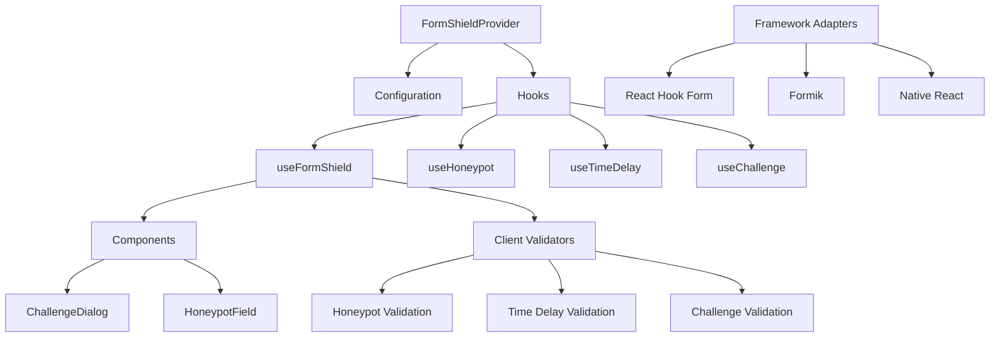
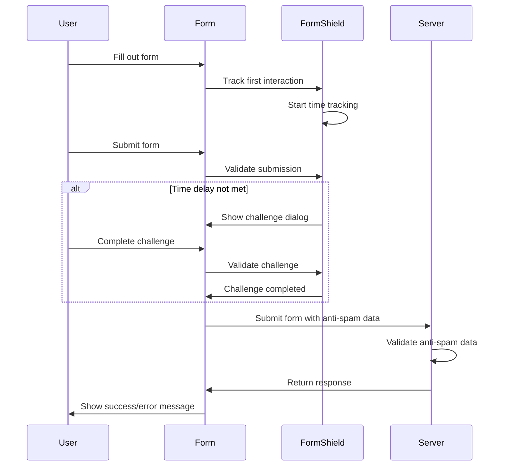

# react-form-shield

<div align="center">
  <p>A comprehensive anti-spam solution for React forms</p>
  
  [](https://www.gnu.org/licenses/gpl-3.0)
</div>

## Features

- 🛡️ **Multi-layered Protection**: Combines honeypot fields, time delay verification, and human verification challenges
- 🔄 **Framework Agnostic**: Works with any React form library (React Hook Form, Formik, etc.)
- 🧩 **Ready-to-Use Components**: Pre-built UI components with customization options
- 🔒 **Server Validation**: Server-side validators for various backend environments
- 📝 **TypeScript Support**: Full TypeScript definitions for better developer experience
- ⚙️ **Customizable Settings**: Configurable features to meet different security needs

## Table of Contents

- [Installation](#installation)
- [Quick Start](#quick-start)
- [Usage Examples](#usage-examples)
- [API Reference](#api-reference)
- [Server Integration](#server-integration)
- [Customization](#customization)
- [Security Considerations](#security-considerations)
- [Contributing](#contributing)
- [License](#license)

## Installation

```bash
npm install react-form-shield
# or
yarn add react-form-shield
# or
pnpm add react-form-shield
```

## Quick Start

```jsx
import {
    useFormShield,
    ChallengeDialog,
    HoneypotField,
} from "react-form-shield";
import { useForm } from "react-hook-form";

function ContactForm() {
    const form = useForm();

    const {
        honeypotProps,
        showChallengeDialog,
        challenge,
        challengeAnswer,
        setChallengeAnswer,
        handleChallengeSubmit,
        validateSubmission,
        getFormShieldData,
    } = useFormShield();

    const onSubmit = async (values) => {
        const validationResult = validateSubmission(values);

        if (validationResult.passed) {
            // Submit form with anti-spam data
            await fetch("/api/contact", {
                method: "POST",
                body: JSON.stringify({
                    ...values,
                    ...getFormShieldData(),
                }),
            });
        }
    };

    return (
        <form onSubmit={form.handleSubmit(onSubmit)}>
            {/* Regular form fields */}
            <input {...form.register("name")} placeholder="Name" />
            <input {...form.register("email")} placeholder="Email" />

            {/* Honeypot field (invisible to humans) */}
            <HoneypotField {...honeypotProps} />

            <button type="submit">Submit</button>

            {/* Challenge dialog */}
            <ChallengeDialog
                open={showChallengeDialog}
                challenge={challenge}
                challengeAnswer={challengeAnswer}
                setChallengeAnswer={setChallengeAnswer}
                onSubmit={() => handleChallengeSubmit(onSubmit)}
            />
        </form>
    );
}
```

## Architecture

### Client-Side Architecture



### Data Flow



## Usage Examples

### With React Hook Form

```jsx
import { useForm } from "react-hook-form";
import {
    useFormShield,
    withReactHookForm,
    ChallengeDialog,
} from "react-form-shield";

function ContactForm() {
    const form = useForm();
    const formShield = useFormShield();

    // Integrate with React Hook Form
    const { register, formState, handleSubmit } = withReactHookForm(
        form,
        formShield
    );

    const onSubmit = async (data) => {
        // Form data already includes anti-spam data
        await fetch("/api/contact", {
            method: "POST",
            body: JSON.stringify(data),
        });
    };

    return (
        <form onSubmit={handleSubmit(onSubmit)}>
            <input {...register("name")} placeholder="Name" />
            <input {...register("email")} placeholder="Email" />
            <button type="submit">Submit</button>

            <ChallengeDialog {...formShield.challengeDialogProps} />
        </form>
    );
}
```

### With Express.js Server

```javascript
const express = require("express");
const { formShieldMiddleware } = require("react-form-shield/server");

const app = express();
app.use(express.json());

app.post("/api/contact", formShieldMiddleware(), (req, res) => {
    // Form data is validated by middleware
    // Process the form submission
    res.json({ success: true });
});

app.listen(3000);
```

## API Reference

See the [full API documentation](./docs/api/index.md) for detailed information.

### Client Hooks

- `useFormShield(options)`: Main hook for form protection
- `useHoneypot(options)`: Hook for honeypot field management
- `useTimeDelay(options)`: Hook for time delay verification
- `useChallenge(options)`: Hook for challenge generation and validation

### Components

- `ChallengeDialog`: Dialog for human verification challenges
- `HoneypotField`: Hidden field for bot detection
- `FormShieldProvider`: Context provider for global configuration

### Server Utilities

- `formShieldMiddleware`: Express/Connect middleware
- `withFormShield`: HOC for Next.js API routes
- `validateFormShield`: Function for manual validation

## Security Considerations

react-form-shield provides multiple layers of protection, but it's important to understand its limitations:

- **Client-side validation can be bypassed**: Always implement server-side validation
- **Honeypot fields can be detected**: Sophisticated bots may identify and avoid honeypot fields
- **Time delay can be spoofed**: Bots can wait before submitting
- **Challenges can be solved programmatically**: Advanced bots may use OCR or AI to solve challenges

For maximum security, combine react-form-shield with other security measures like CAPTCHA, rate limiting, and IP blocking.

## Anti-Spam Features

### 1. Honeypot Fields

Honeypot fields are hidden form fields that are invisible to human users but are typically filled out by bots. When a submission contains data in these fields, it's flagged as a bot submission.

```jsx
<HoneypotField name="random_field" />
```

### 2. Time Delay Verification

Time delay verification ensures that the form wasn't submitted too quickly, which is a common characteristic of bot submissions. The library tracks the time between form load and submission, requiring a minimum delay.

```jsx
// Configure minimum submission time
const formShield = useFormShield({
    minSubmissionTime: 15, // 15 seconds
});
```

### 3. Human Verification Challenges

When time delay verification fails, the library can present human verification challenges, such as simple math problems or custom questions that are easy for humans but difficult for bots.

```jsx
<ChallengeDialog
    open={showChallengeDialog}
    challenge={challenge}
    challengeAnswer={challengeAnswer}
    setChallengeAnswer={setChallengeAnswer}
    onSubmit={handleChallengeSubmit}
/>
```

### 4. Multiple Challenge Support

For forms that require stronger protection, the library supports multiple challenges to compensate for time deficits. The number of challenges required is calculated based on how much the submission time falls short of the minimum requirement.

```jsx
// Configure multiple challenges
const formShield = useFormShield({
    enableMultipleChallenges: true,
    maxChallenges: 3,
    challengeTimeValue: 5, // Each challenge is worth 5 seconds
});
```

### 5. Server-Side Validation

All client-side protections are duplicated on the server to prevent bypass attempts. The server-side middleware validates honeypot fields, time delay, and challenge completion.

```javascript
// Express middleware
app.post(
    "/api/contact",
    formShieldMiddleware({
        honeypotCheck: true,
        timeDelayCheck: true,
        challengeCheck: true,
    }),
    (req, res) => {
        // Process valid submission
    }
);
```

## Contributing

We welcome contributions! Please see our [Contributing Guide](CONTRIBUTING.md) for details.

## License

This project is licensed under the GNU General Public License v3.0 - see the [LICENSE](LICENSE) file for details.
