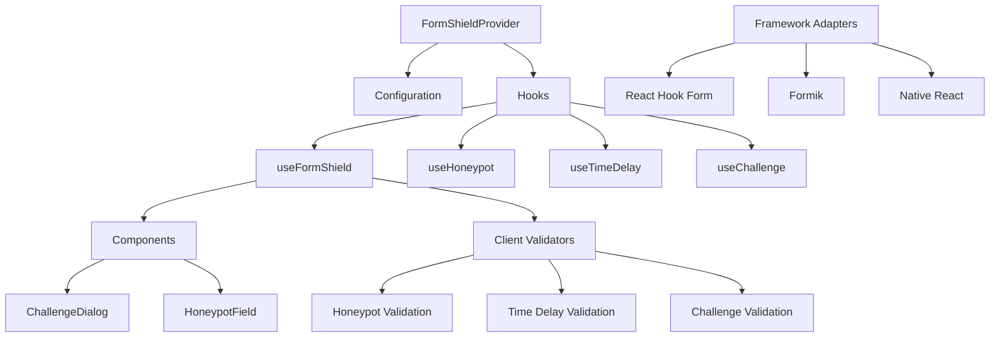

# Client-Side Architecture

This diagram illustrates the architecture of react-form-shield's client-side components.

## Components

- **FormShieldProvider**: Context provider for global configuration
- **Hooks**: React hooks for form protection
    - **useFormShield**: Main hook for form protection
    - **useHoneypot**: Hook for honeypot field management
    - **useTimeDelay**: Hook for time delay verification
    - **useChallenge**: Hook for challenge generation and validation
- **Components**: UI components
    - **ChallengeDialog**: Dialog for human verification challenges
    - **HoneypotField**: Hidden field for bot detection
- **Adapters**: Framework adapters
    - **React Hook Form**: Adapter for React Hook Form
    - **Formik**: Adapter for Formik
    - **Native React**: Adapter for native React forms
- **Validators**: Client-side validators
    - **Honeypot Validation**: Validates honeypot fields
    - **Time Delay Validation**: Validates time delay
    - **Challenge Validation**: Validates challenge completion
