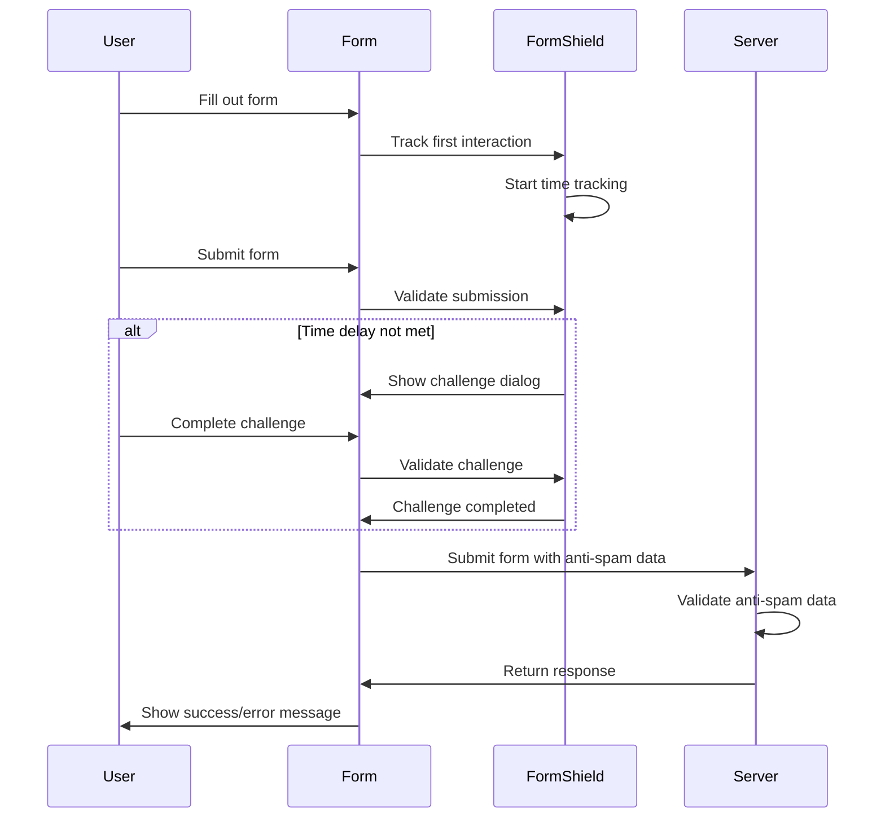

# Data Flow

This diagram illustrates the data flow between the user, form, FormShield, and server.

## Flow Description

1. **User Interaction**:

    - User fills out the form
    - Form tracks the first interaction (focus)
    - FormShield starts time tracking

2. **Form Submission**:

    - User submits the form
    - Form sends data to FormShield for validation

3. **Validation Process**:

    - If time delay is not met:
        - FormShield shows challenge dialog
        - User completes the challenge
        - Form sends challenge answer to FormShield
        - FormShield validates the challenge
    - If validation passes, form proceeds with submission

4. **Server-Side Validation**:
    - Form sends data to server with anti-spam data
    - Server validates the anti-spam data
    - Server returns response
    - Form shows success or error message to user
